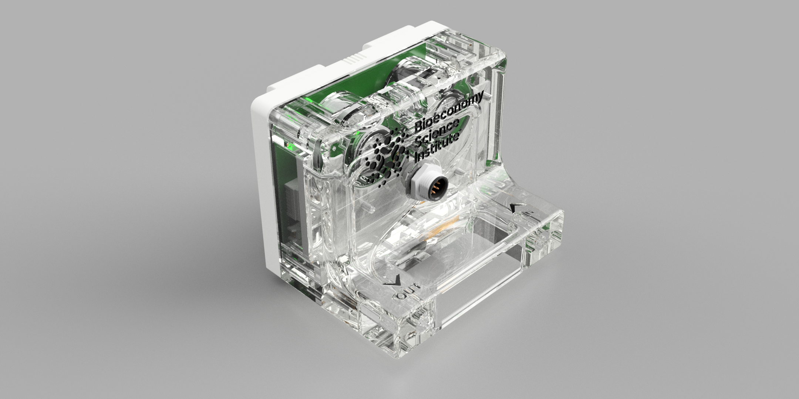

# O2-CO2 Gas Analyser

A precision gas analysis system built on the SAMD21 microcontroller platform, featuring simultaneous O2 and CO2 measurement with temperature-controlled sampling chamber and Modbus RTU communication.



## Features

- **O2 Measurement**: SGX 4OX electrochemical oxygen sensor with temperature compensation
- **CO2 Measurement**: SGX INIR2-CD100 infrared CO2 sensor (0-10% range)
- **Temperature Control**: PID-controlled heater maintaining stable measurement conditions
- **Humidity Sensing**: Sensirion SHT4x for gas temperature and relative humidity
- **Communication**: Modbus RTU over RS-485 with configurable baud rate and addressing
- **Status Monitoring**: Comprehensive status register for system health monitoring
- **Calibration**: In-field zero and span calibration for both O2 and CO2 sensors

## Hardware

- **MCU**: SAMD21-based custom board (gas_analyser_m0)
- **O2 Sensor**: SGX 4OX (galvanic cell, 70-130 uA in air)
- **CO2 Sensor**: SGX INIR2-CD100 (NDIR, UART interface)
- **Temperature/Humidity**: Sensirion SHT40
- **Heater**: PWM-controlled with NTC thermistor feedback
- **Interface**: RS-485 with optional 120 Ohm termination

---

## Modbus RTU Interface

### Default Communication Settings

| Parameter | Default Value |
|-----------|---------------|
| Slave ID | 100 |
| Baud Rate | 9600 |
| Data Bits | 8 |
| Parity | None |
| Stop Bits | 1 |

### Supported Function Codes

| Function Code | Description |
|---------------|-------------|
| 03 | Read Holding Registers |
| 04 | Read Input Registers |
| 06 | Write Single Holding Register |
| 16 | Write Multiple Holding Registers |

---

## Register Definitions

### Input Registers (Function Code 04) - Read Only

Input registers contain sensor measurements. All floating-point values are stored as IEEE 754 single-precision (32-bit) spanning two consecutive 16-bit registers in big-endian order.

| Address | Name | Type | Unit | Description |
|---------|------|------|------|-------------|
| 0-1 | O2percent | float | % | Oxygen concentration |
| 2-3 | CO2percent | float | % | CO2 concentration (as percentage) |
| 4-5 | CO2ppm | float | ppm | CO2 concentration (as ppm) |
| 6-7 | gasTempC | float | C | Gas stream temperature (SHT40) |
| 8-9 | gasRH | float | %RH | Gas stream relative humidity |
| 10-11 | gasAH | float | g/m3 | Absolute humidity |
| 12-13 | gasVP | float | Pa | Vapour pressure |
| 14-15 | ambTempC | float | C | Ambient temperature (NTC) |
| 16-17 | heatTempC | float | C | Heater block temperature (NTC) |

### Holding Registers (Function Code 03/06/16) - Read/Write

Holding registers contain configuration and calibration parameters. Changes are automatically saved to non-volatile memory.

| Address | Name | Type | Unit | Description |
|---------|------|------|------|-------------|
| 0-1 | status | uint32 | - | System status register (see below) |
| 2 | modbusSlaveID | uint16 | - | Modbus slave address (2-246) |
| 3 | modbusBaudrate | uint16 | x10 | Baud rate / 10 (e.g., 960 = 9600) |
| 4 | modbusStopBits | uint16 | - | Stop bits (1-3) |
| 5 | modbusParity | uint16 | - | Parity: 1=Even, 2=Odd, 3=None |
| 6 | modbus120Rterm | uint16 | - | RS-485 termination: 0=Off, 1=On |
| 7 | reserved1 | uint16 | - | Reserved for future use |
| 8 | O2SetZeroPoint | uint16 | - | Write 1 to start O2 zero cal |
| 9 | CO2SetZeroPoint | uint16 | ppm | CO2 zero cal reference (1-4999) |
| 10-11 | O2SetXPoint | float | % | O2 span cal point (10.0-25.0) |
| 12-13 | CO2SetXPoint | float | ppm | CO2 span cal point (300-50000) |
| 14-15 | heaterKp | float | - | PID proportional gain |
| 16-17 | heaterKi | float | - | PID integral gain |
| 18-19 | heaterKd | float | - | PID derivative gain |
| 20-21 | heaterMaxI | float | - | PID integral limit (0-255) |
| 22-23 | heaterSetpointC | float | C | Heater setpoint (20.0-50.0) |
| 24-25 | heaterMinAmbientDeltaC | float | C | Min delta above ambient (0-20) |

#### Valid Baud Rate Values

| Register Value | Actual Baud Rate |
|----------------|------------------|
| 960 | 9600 |
| 1920 | 19200 |
| 3840 | 38400 |
| 5760 | 57600 |
| 11520 | 115200 |

---

## Status Register

The status register (holding registers 0-1) is a 32-bit value containing system health information. Each 4-bit nibble represents a different subsystem.

### Status Register Bit Layout

```
Bits 31-24       23-20      19-16               15-12       11-8          7-4    3-0
     [WDT Count] [Amb Temp] [Gas Temp/Humidity] [Heater]    [CO2 Sensor]  [O2]   [System]
```

### Subsystem Status Definitions

#### System Status (Bits 3-0)
| Value | Meaning |
|-------|---------|
| 0x01 | System OK |
| 0x02 | WDT Reset Occurred |
| 0x03 | System OK + WDT Reset History |

#### O2 Sensor Status (Bits 7-4)
| Value | Meaning |
|-------|---------|
| 0x01 | Sensor OK |
| 0x02 | Reading too high (>25%) |
| 0x04 | Sensor not connected (<1%) |

#### CO2 Sensor Status (Bits 11-8)
| Value | Meaning |
|-------|---------|
| 0x01 | Sensor OK |
| 0x02 | Sensor not connected (no data) |
| 0x04 | Sensor communication error |

#### Heater Status (Bits 15-12)
| Value | Meaning |
|-------|---------|
| 0x01 | Temperature stable |
| 0x02 | Temperature unstable (>0.2C from setpoint) |
| 0x04 | Temperature sensor error |

#### Gas Temperature/Humidity Status (Bits 19-16)
| Value | Meaning |
|-------|---------|
| 0x01 | Sensor OK |
| 0x02 | Sensor error |

#### Ambient Temperature Status (Bits 23-20)
| Value | Meaning |
|-------|---------|
| 0x01 | Sensor OK |
| 0x02 | Sensor error |

#### WDT Reset Count (Bits 27-24)
Contains the number of watchdog timer resets since last EEPROM clear (0-255, saturates at 255).

---

## Usage Examples

### Reading Sensor Values (Python with pymodbus)

```python
from pymodbus.client import ModbusSerialClient
import struct

# Connect to the analyser
client = ModbusSerialClient(
    port='COM3',
    baudrate=9600,
    parity='N',
    stopbits=1,
    bytesize=8,
    timeout=1
)
client.connect()

SLAVE_ID = 100

def read_float(client, address, slave_id):
    """Read a 32-bit float from two consecutive input registers."""
    result = client.read_input_registers(address, 2, slave=slave_id)
    if result.isError():
        return None
    # Combine two 16-bit registers into a 32-bit float (big-endian)
    raw = (result.registers[0] << 16) | result.registers[1]
    return struct.unpack('>f', struct.pack('>I', raw))[0]

# Read all sensor values
o2_percent = read_float(client, 0, SLAVE_ID)
co2_percent = read_float(client, 2, SLAVE_ID)
co2_ppm = read_float(client, 4, SLAVE_ID)
gas_temp = read_float(client, 6, SLAVE_ID)
gas_rh = read_float(client, 8, SLAVE_ID)
heater_temp = read_float(client, 16, SLAVE_ID)

print(f"O2: {o2_percent:.2f}%")
print(f"CO2: {co2_ppm:.0f} ppm ({co2_percent:.3f}%)")
print(f"Gas Temperature: {gas_temp:.1f}C")
print(f"Gas RH: {gas_rh:.1f}%")
print(f"Heater Temperature: {heater_temp:.1f}C")

client.close()
```

### Parsing the Status Register

```python
def parse_status(client, slave_id):
    """Read and parse the status register."""
    result = client.read_holding_registers(0, 2, slave=slave_id)
    if result.isError():
        return None
    
    status = (result.registers[0] << 16) | result.registers[1]
    
    # Extract each nibble
    system_status = status & 0x0F
    o2_status = (status >> 4) & 0x0F
    co2_status = (status >> 8) & 0x0F
    heater_status = (status >> 12) & 0x0F
    gas_th_status = (status >> 16) & 0x0F
    amb_temp_status = (status >> 20) & 0x0F
    wdt_count = (status >> 24) & 0xFF
    
    # Interpret statuses
    status_names = {
        'system': {0x01: 'OK', 0x02: 'WDT Reset', 0x03: 'OK (WDT history)'},
        'o2': {0x01: 'OK', 0x02: 'Too High', 0x04: 'Not Connected'},
        'co2': {0x01: 'OK', 0x02: 'Not Connected', 0x04: 'Error'},
        'heater': {0x01: 'Stable', 0x02: 'Unstable', 0x04: 'Sensor Error'},
        'gas_th': {0x01: 'OK', 0x02: 'Error'},
        'amb_temp': {0x01: 'OK', 0x02: 'Error'}
    }
    
    print(f"System: {status_names['system'].get(system_status, 'Unknown')}")
    print(f"O2 Sensor: {status_names['o2'].get(o2_status, 'Unknown')}")
    print(f"CO2 Sensor: {status_names['co2'].get(co2_status, 'Unknown')}")
    print(f"Heater: {status_names['heater'].get(heater_status, 'Unknown')}")
    print(f"Gas Temp/RH: {status_names['gas_th'].get(gas_th_status, 'Unknown')}")
    print(f"Ambient Temp: {status_names['amb_temp'].get(amb_temp_status, 'Unknown')}")
    print(f"WDT Reset Count: {wdt_count}")
    
    return status

parse_status(client, SLAVE_ID)
```

### Writing Configuration (Changing Heater Setpoint)

```python
def write_float(client, address, value, slave_id):
    """Write a 32-bit float to two consecutive holding registers."""
    # Pack float as big-endian 32-bit
    raw = struct.unpack('>I', struct.pack('>f', value))[0]
    high_word = (raw >> 16) & 0xFFFF
    low_word = raw & 0xFFFF
    
    # Write both registers
    result = client.write_registers(address, [high_word, low_word], slave=slave_id)
    return not result.isError()

# Set heater setpoint to 40C
if write_float(client, 21, 40.0, SLAVE_ID):
    print("Heater setpoint updated to 40C")
else:
    print("Failed to update heater setpoint")
```

### Changing Modbus Settings

```python
# Change slave ID to 50
client.write_register(2, 50, slave=SLAVE_ID)

# Change baud rate to 19200 (write 1920 = 19200/10)
client.write_register(3, 1920, slave=SLAVE_ID)

# Enable 120 Ohm termination
client.write_register(6, 1, slave=SLAVE_ID)

# Note: After changing communication settings, 
# you will need to reconnect with the new parameters
```

---

## Calibration Procedures

### O2 Sensor Calibration

The O2 sensor supports two-point calibration: zero (0% O2) and span (typically 20.9% in air).

#### Zero Calibration (0% O2)

1. Flow nitrogen or other zero-O2 gas through the sensor
2. Wait for readings to stabilise
3. Write `1` to register 7 (`O2SetZeroPoint`)

```python
# Start O2 zero calibration
client.write_register(7, 1, slave=SLAVE_ID)
# Calibration takes up to 60 seconds
# Monitor status - system enters STATE_CALIBRATING_O2
```

#### Span Calibration (e.g., 20.9% O2)

1. Flow calibration gas (e.g., ambient air at 20.9% O2)
2. Wait for readings to stabilise
3. Write the known O2 percentage as a float to registers 8-9

```python
# Calibrate with 20.9% O2 (ambient air)
write_float(client, 8, 20.9, SLAVE_ID)
# Calibration takes up to 60 seconds
```

**Calibration Requirements:**
- Sensor current must be within 70-130 uA for air
- Reading must stabilise (+/-0.1 uA for 5 consecutive readings)
- Maximum calibration time: 60 seconds

### CO2 Sensor Calibration

#### Zero Calibration

1. Flow nitrogen or zero-CO2 gas through the sensor
2. Wait for readings to stabilise
3. Write the expected zero reading (typically 0-400 ppm) to register 10

```python
# Set CO2 zero point (expects 0 ppm, sensor reads 50 ppm)
# Write 50 to offset the reading
client.write_register(10, 50, slave=SLAVE_ID)
```

#### Span Calibration

Span calibration for CO2 is reserved for future implementation (registers 11-12).

---

## LED Status Indicator

The analyser has an RGB LED that indicates system state:

| Colour | Pattern | State |
|--------|---------|-------|
| Green | 1 Hz blink | Normal operation |
| Magenta | 1 Hz blink | Startup |
| Amber | 0.5 Hz blink | Temperature unstable |
| Blue | 0.5 Hz blink | O2 calibration in progress |
| Red | 0.5 Hz blink | Error condition |

---

## Building and Flashing

This project uses PlatformIO. To build and upload:

```bash
# Build
pio run

# Upload via Atmel-ICE
pio run --target upload
```

### Dependencies

All libraries are included in the `lib/` folder:
- Adafruit NeoPixel ZeroDMA
- Sensirion I2C SHT4x
- FlashStorage SAMD
- Custom libraries: SGX_4OX, SGX_INIR2_CD100, NTC_Therm, PID_Control, modbus-rtu-slave

---

## Troubleshooting

### No Modbus Response
- Check RS-485 wiring (A/B polarity)
- Verify baud rate and slave ID
- Check termination resistor setting if at end of bus

### O2 Reading Shows 0%
- Check O2 sensor connection
- Verify sensor current is within range (status register)
- Sensor may need replacement if current is <70 uA in air

### Temperature Unstable (Amber LED)
- Allow 5+ minutes for heater to stabilise after power-on
- Check ambient temperature is not too close to setpoint
- Verify heater NTC is properly installed

### CO2 Sensor Not Responding
- Check UART connection (38400 baud)
- Verify sensor is powered and warmed up
- Check status register for sensor errors

---

## License

This project is provided as-is for reference and educational purposes.
